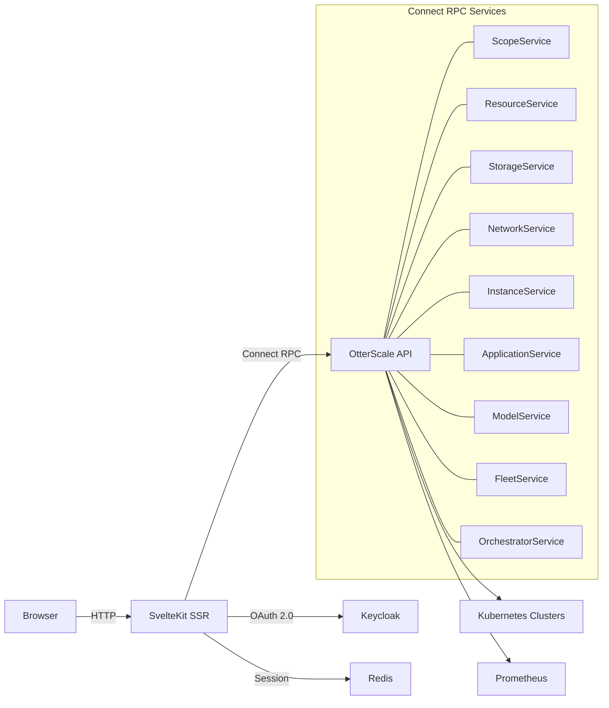

# OtterScale Dashboard

[](https://github.com/otterscale/dashboard/actions)
[](LICENSE)

Kubernetes multi-cluster management UI — SvelteKit + Connect RPC.

## Architecture



## 🚀 Quick Start

```bash
# Clone
git clone https://github.com/otterscale/dashboard.git && cd dashboard

# Configure
cp .env.example .env   # edit .env

# Dev
pnpm install && pnpm dev

# Production (Docker)
docker build -t otterscale/dashboard .
docker run -p 3000:3000 --env-file .env otterscale/dashboard
```

## ⚙️ Configuration

| `ENV_VAR`                | Default                 | Description                            |
| ------------------------ | ----------------------- | -------------------------------------- |
| `PUBLIC_WEB_URL`         | `http://localhost:3000` | Public URL (required)                  |
| `API_URL`                | `http://localhost:8299` | OtterScale API endpoint (required)     |
| `REDIS_URL`              | —                       | Redis connection string (required)     |
| `KEYCLOAK_REALM_URL`     | —                       | Keycloak realm URL (required)          |
| `KEYCLOAK_CLIENT_ID`     | —                       | OAuth client ID (required)             |
| `KEYCLOAK_CLIENT_SECRET` | —                       | OAuth client secret (required)         |
| `BOOTSTRAP_MODE`         | `0`                     | Skip auth for initial setup (optional) |

## Features

- **Multi-cluster K8s management** — scopes, resources, RBAC
- **Storage orchestration** — Ceph pools, OSD, NFS, SMB, object gateway
- **VM lifecycle** — create, manage, console via xterm.js
- **AI/ML model serving** — LLM deployment & inference proxy
- **Prometheus monitoring** — built-in metrics & dashboards

## License

[AGPL-3.0](LICENSE)
