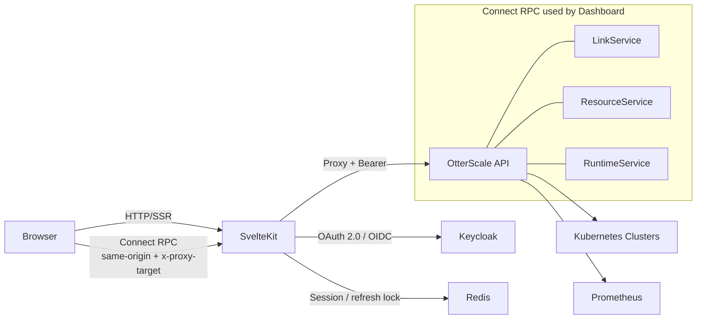

# OtterScale Dashboard

**The web UI for OtterScale — manage multi-cluster Kubernetes, storage, virtual machines, and AI workloads from one place.**

OtterScale Dashboard is a SvelteKit application that talks to the [OtterScale API](https://github.com/otterscale/api) over Connect RPC. It handles authentication against Keycloak, proxies requests to the gateway, and renders a unified operations console for every connected cluster.

## Architecture

```mermaid
graph LR
    Browser -->|HTTP/SSR| SvelteKit[SvelteKit]
    Browser -->|Connect RPC<br/>same-origin + x-proxy-target| SvelteKit
    SvelteKit -->|OAuth 2.0 / OIDC| Keycloak[Keycloak]
    SvelteKit -->|Session / refresh lock| Redis[Redis]
    SvelteKit -->|Proxy + Bearer| API[OtterScale API]
    API --> K8s[Kubernetes Clusters]
    API --> Prometheus[Prometheus]

    subgraph Connect RPC used by Dashboard
        API --- LinkService[LinkService]
        API --- ResourceService[ResourceService]
        API --- RuntimeService[RuntimeService]
    end
```

## Features

- **Multi-cluster Kubernetes management** — scopes, resources, and RBAC.
- **Storage orchestration** — Ceph pools, OSD, NFS, SMB, and object gateways.
- **VM lifecycle** — create, manage, and access consoles via xterm.js and VNC.
- **AI/ML model serving** — LLM deployment and an inference proxy.
- **Monitoring** — built-in metrics and dashboards backed by Prometheus.

## Tech Stack

Built with SvelteKit, TypeScript, Tailwind CSS, and Vite. UI building blocks include Monaco Editor, xterm.js, NoVNC, and LayerChart, with internationalization powered by Inlang Paraglide.

## Documentation

Setup, configuration, and deployment guides will be published in the project documentation. See `.env.example` for the environment variables the app expects.

## Ecosystem

OtterScale Dashboard is the web UI for the OtterScale platform. See the [otterscale](https://github.com/otterscale/otterscale) repository for an overview of the full project and its components.

## Contributing

Contributions are welcome. A contribution guide (`CONTRIBUTING.md`) will follow; until then, please open an issue or a pull request to get involved.

## License

This project is licensed under the [GNU Affero General Public License v3.0](LICENSE).

